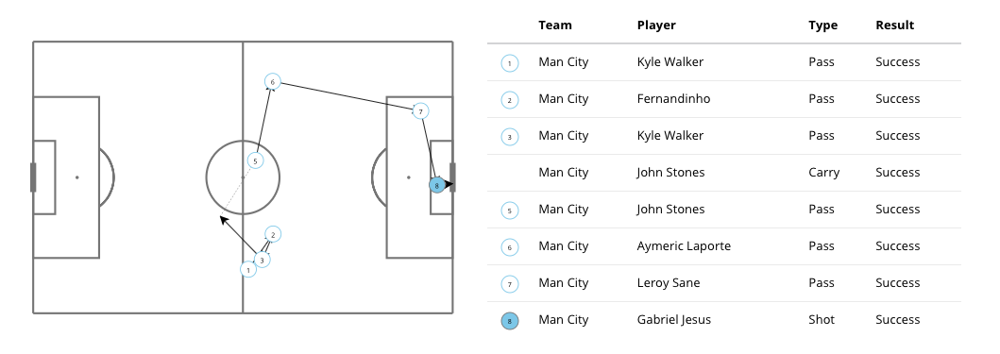
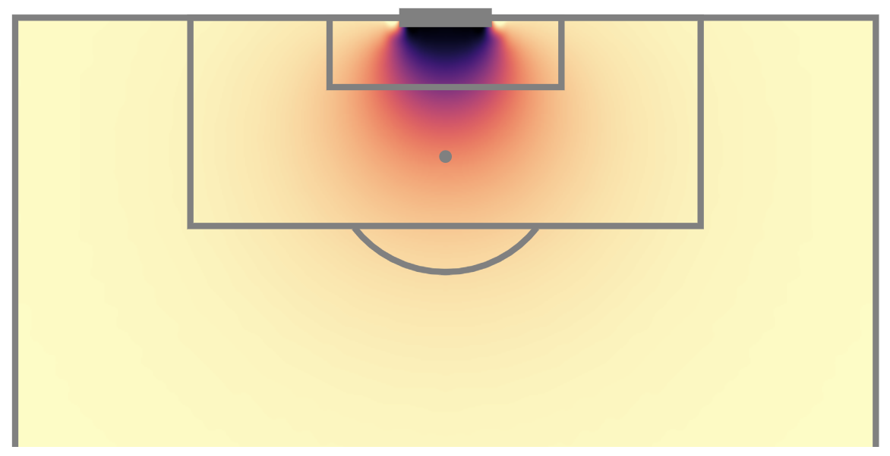
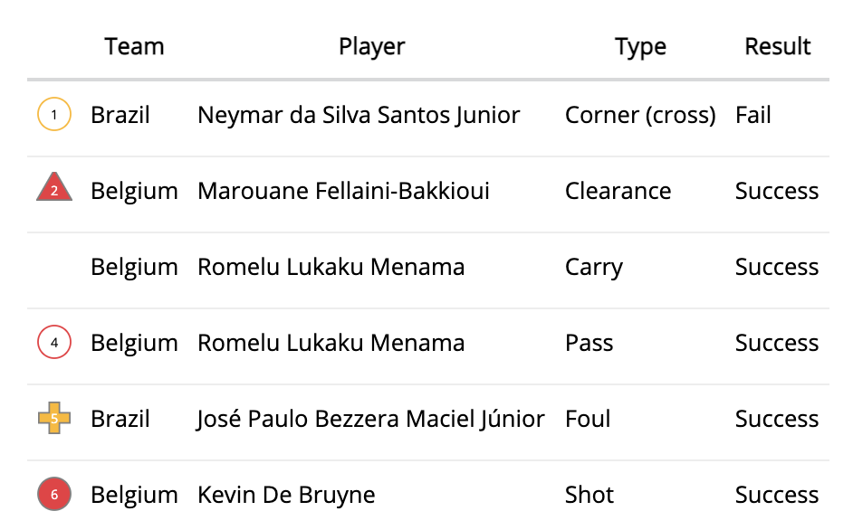
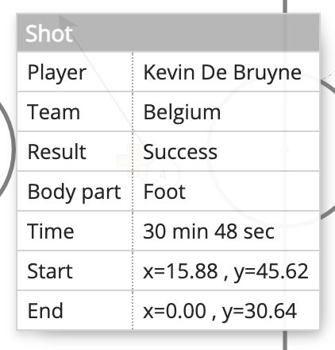
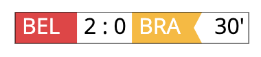

# d3-soccer

A D3 plugin for visualizing event stream soccer data.

<div align="center">
  
</div>

## Installing

If you use NPM, `npm install d3-soccer`. Otherwise, download the [latest release](https://github.com/probberechts/d3-soccer/releases/latest). AMD, CommonJS, and vanilla environments are supported. In vanilla, a d3 global is exported:

```html
<script src="https://d3js.org/d3.v5.min.js"></script>
<script type="text/javascript" src="./dist/d3-soccer.js"></script>
<script type="text/javascript">
var pitch = d3.pitch();
var svg = d3.select("#chart").call(pitch);
</script>
```

## API Reference

<a name="pitch" href="#pitch">#</a> d3.<b>pitch</b>()

Creates a new pitch generator with the default configuration values. The pitch contains two layers (`#below` and `#above`) which can be used to plot additional markers respectively below and above the pitch markers. The origin is located in the top-left corner of the pitch and the default dimensions are (105, 68).

<a name="_pitch" href="#_pitch">#</a> <i>pitch</i>(<i>context</i>)

Render the pitch to the given *context*, which may be either a [selection](https://github.com/d3/d3-selection) of containers (either HTML, SVG or G elements) or a corresponding [transition](https://github.com/d3/d3-transition).


<a name="pitch_height" href="#pitch_height">#</a> <i>pitch</i>.<b>height</b>([<i>height</i>])

If a _height_ is specified, it sets the height of the corresponding SVG element and computes the adequate width. If _height_ is not specified, returns the current height, which defaults to 300 px.

<a name="pitch_width" href="#pitch_width">#</a> <i>pitch</i>.<b>width</b>()

Returns the current width of the SVG element.

<a name="pitch_rotate" href="#pitch_rotate">#</a> <i>pitch</i>.<b>rotate</b>([<i>bool</i>])

If _bool_ is specified and set to `true`, rotate the plot by 90 degrees. If _bool_ is not specified, returns the current setting, which defaults to false.

<a name="pitch_showDirOfPlay" href="#pitch_showDirOfPlay">#</a> <i>pitch</i>.<b>showDirOfPlay</b>([<i>bool</i>])

If _bool_ is specified and set to `true`, shows an arrow on the plot from left to right to indicate the direction of play. If _bool_ is not specified, returns the current setting, which defaults to false.

<a name="pitch_shadeMiddleThird" href="#pitch_shadeMiddleThird">#</a> <i>pitch</i>.<b>shadeMiddleThird</b>([<i>bool</i>])

If _bool_ is specified and set to `true`, the middle third of the pitch is shaded. If _bool_ is not specified, returns the current setting, which defaults to false.

<a name="pitch_goals" href="#pitch_goals">#</a> <i>pitch</i>.<b>goals</b>([<i>goals</i>])

The standard goal markings can be customized by supplying a function to the _goals_ argument. Additionally, the _goals_ argument supports the strings "line" and "box", which correspond to line-style and box-style goal markings. 
If _goals_ is not specified, returns the current setting, which defaults to line-style markings.

<a name="pitch_clip" href="#pitch_clip">#</a> <i>pitch</i>.<b>clip</b>([<i>clip</i>])

If _clip_ is specified, sets the clipping rectangle and computes the adequate [_width_](#pitch_width). _clip_ is specified as a pair of 2D coordinates \[x, y\]. If _clip_ is not specified, returns the current clipping rectangle, which defaults to: `[[0, 0], [105, 68]]`

<a name="pitch_pitchStrokeWidth" href="#pitch_pitchStrokeWidth">#</a> <i>pitch</i>.<b>pitchStrokeWidth</b>([<i>width</i>])

If _width_ is specified, it sets the stroke width of the pitch markers. If _width_ is not specified, returns the current stroke width, which defaults to 0.5 px.


<hr>

<a name="heatmap" href="#heatmap">#</a> d3.<b>heatmap</b>(pitch)

Creates a new heatmap generator with the default configuration values and the specified [pitch](#pitch) configuration.

<a name="_heatmap" href="#_heatmap">#</a> <i>heatmap</i>(<i>context</i>)

Render the heatmap to the given *context*, which may be either a [selection](https://github.com/d3/d3-selection) of containers (either HTML, SVG or G elements) or a corresponding [transition](https://github.com/d3/d3-transition). Reads the data for the heatmap from the datum property on the container. This data should be in the following format:

```
[
  {
    height: 0.99,  // height of the cell
    width: 0.99,   // width of the cell
    x: 4.95,       // x-index of the cell
    y: 54.20,      // x-index of the cell
    i: 5,          // x-index of the cell
    j: 55,         // y-index of the cell
    value: 0       // value of the cell
  },
  ...
]
```

D3 soccer provides two layouts to convert data to this format: <a href="#grid">d3.<b>grid</b>()</a> and <a href="#rectbin">d3.<b>rectbin</b>()</a> .



<a name="heatmap_colorScale" href="#heatmap_colorScale">#</a> <i>heatmap</i>.<b>colorScale</b>([<i>scale</i>])

If _scale_ is specified, sets the color scale, which should be an instance of [d3-scale](https://github.com/d3/d3-scale). If _scale_ is not specified, returns the current color scale, which defaults to `d3.scaleSequential(d3.interpolateGreens)`.

<a name="heatmap_enableInteraction" href="#heatmap_enableInteraction">#</a> <i>heatmap</i>.<b>enableInteraction</b>([<i>enable</i>])

If _enable_ is set to true, a border will be drawn around a cell of the heatmap when hovered. Additional actions can be assigned trough [onSelect](#heatmap_onSelect) and [onDeselect](#heatmap_onDeselect). If not set, returns the current configuration. Interaction is disabled by default.

<a name="heatmap_interpolate" href="#heatmap_interpolate">#</a> <i>heatmap</i>.<b>interpolate</b>([<i>interpolate</i>])

If _interpolate_ is set to true, the heatmap will be interpolated using bicubic interpolation. If not set, returns the current configuration, which defaults to false.

<a name="heatmap_selected" href="#heatmap_selected">#</a> <i>heatmap</i>.<b>selected</b>([<i>cell</i>])

If _cell_ is specified, sets the selected cell. _cell_ should be specified as 2D coordinates \[x, y\], where (0,0) corresponds to the top left corner cell. If _cell_ is not specified, returns the current selection. Returns `[undefined, undefined]` if no cell is selected, which is the default.

<a name="heatmap_onSelect" href="#heatmap_onSelect">#</a> <i>heatmap</i>.<b>onSelect</b>([<i>f</i>])

If _f_ is specified, hovering over a cell will trigger execution of _f(x, y, v)_, where _x_ and _y_ are the coordinates of the selected cell and _v_ the cell value. 

<a name="heatmap_onDeselect" href="#heatmap_onDeselect">#</a> <i>heatmap</i>.<b>onDeselect</b>([<i>f</i>])

If _f_ is specified, stopping hovering over a cell will trigger execution of _f()_. 

<hr>


<a name="actions" href="#actions">#</a> d3.<b>actions</b>(pitch)

Creates a new generator for plotting soccer actions in the [SPADL format](https://github.com/ML-KULeuven/socceraction) with the default configuration values and the specified [pitch](#pitch) configuration.


<a name="_actions" href="#_actions">#</a> <i>actions</i>(<i>context</i>)

Render the actions to the given *context*, which may be either a [selection](https://github.com/d3/d3-selection) of containers (either HTML, SVG or G elements) or a corresponding [transition](https://github.com/d3/d3-transition). Reads the data for the actions from the datum property on the container.


<a name="actions_showTooltip" href="#actions_showTooltip">#</a> <i>actions</i>.<b>showTooltip</b>([<i>show</i>])

If _show_ is set to an instance of [actionTooltip](#actionTooltip), will show a tooltip upon hovering an action. If not specified, will return a reference to the current tooltip or false if no tooltip is attached. Defaults to false.

<a name="actions_scale" href="#actions_scale">#</a> <i>actions</i>.<b>scale</b>([<i>scale</i>])

If _scale_ is specified, will set the scale of the action markers. If not specified, will return the current scale, which defaults to 4.

<a name="actions_teamColors" href="#actions_teamColors">#</a> <i>actions</i>.<b>teamColors</b>([<i>colors</i>])

If _colors_ is specified, will set the colors used for the markers of both teams. Excepts a mapping between team ID and a color hex code, for example `{782:"#EF3340", 781:"#FDB913"}`. If _colors_ is not specified, returns the current mapping between teams and colors, which defaults to `{0: "#FDB913", 1: "#87CEEB"}`.

<a name="actions_draggable" href="#actions_draggable">#</a> <i>actions</i>.<b>draggable</b>([<i>draggable</i>])

If _draggable_ is set to true, will enable dragging the action markers around and trigger [onUpdate](#actions_onUpdate). If not specified, returns the current setting which defaults to false.

<a name="actions_onUpdate" href="#actions_onUpdate">#</a> <i>actions</i>.<b>onUpdate</b>([<i>f</i>])

If _f_ is specified, dragging an action's marker will trigger execution of _f(data)_, where _data_ are the updated actions.

<hr>

<a name="actionsTable" href="#actionsTable">#</a> d3.<b>actionsTable</b>()

<a name="_actionsTable" href="#_actionsTable">#</a> <i>actionsTable</i>(<i>context</i>)

<br/>

<a name="actionsTable_tableColumns" href="#actionsTable_tableColumns">#</a> <i>actionsTable</i>.<b>tableColumns</b>([<i>columns</i>])

<a name="actionsTable_scale" href="#actionsTable_scale">#</a> <i>actionsTable</i>.<b>scale</b>([<i>scale</i>])

<a name="actionsTable_teamColors" href="#actionsTable_teamColors">#</a> <i>actionsTable</i>.<b>teamColors</b>([<i>colors</i>])

<hr>

<a name="actionTooltip" href="#actionTooltip">#</a> d3.<b>actionTooltip</b>()


<a name="_actionTooltip" href="#_actionTooltip">#</a> <i>actionTooltip</i>(<i>context</i>)



<a name="actionTooltip_show" href="#actionTooltip_show">#</a> <i>actionTooltip</i>.<b>show</b>([<i>data</i>])

<a name="actionTooltip_hide" href="#actionTooltip_hide">#</a> <i>actionTooltip</i>.<b>hide</b>()


<hr>


<a name="scoreline" href="#scoreline">#</a> d3.<b>scoreline</b>()


<a name="_scoreline" href="#_scoreline">#</a> <i>scoreline</i>(<i>context</i>)



<a name="scoreline_height" href="#scoreline_height">#</a> <i>scoreline</i>.<b>height</b>([<i>height</i>])

<a name="scoreline_teams" href="#scoreline_teams">#</a> <i>scoreline</i>.<b>teams</b>([<i>teams</i>])

<a name="scoreline_score" href="#scoreline_score">#</a> <i>scoreline</i>.<b>score</b>([<i>score</i>])

<a name="scoreline_clock" href="#scoreline_clock">#</a> <i>scoreline</i>.<b>clock</b>([<i>clock</i>])

<hr>

<a name="grid" href="#grid">#</a> d3.<b>grid</b>()

Constructs a new default grid layout, which can be used to generate data for the heatmap.

<a name="_grid" href="#_grid">#</a> <b>grid</b>(<i>values</i>)

Evaluates the grid layout on the specified 2d array of *values*, returning a 1d array corresponding to the data format required by the <a href="#heatmap">heatmap</a>.

<hr>

<a name="rectbin" href="#rectbin">#</a> d3.<b>rectbin</b>()

Constructs a new default rectbin layout, which can be used to generate data for the heatmap.

<a name="rectbin" href="#_rectbin">#</a> <b>rectbin</b>(<i>points</i>)

Evaluates the rectbin layout on the specified array of *points*, returning an array of rectangular *bins*. Each bin is an array containing the bin’s points, as well as some additional properties which are required by the <a href="#heatmap">heatmap</a>.

Bins that are empty are not omitted. The origin bin at ⟨0,0⟩ is in the top-left.

<a name="x" href="#x">#</a> rectbin.<b>x</b>([<i>accessor</i>])

If *accessor* is specified, sets the *x*-accessor function and returns the rectbin layout; if *accessor* is not specified, returns the current *x*-accessor function, which defaults to `function(d) { return d[0]; }`.

<a name="y" href="#y">#</a> rectbin.<b>y</b>([<i>accessor</i>])

If *accessor* is specified, sets the *y*-accessor function and returns the rectbin layout; if *accessor* is not specified, returns the current *y*-accessor function, which defaults to `function(d) { return d[1]; }`.

<a href="dx" href="#dx">#</a> rectbin.<b>dx</b>([<i>dx</i>])

If *dx* is specified, sets the horizontal bin size to the specified value. If *dx* is not specified, returns the current value, which defaults to 0.1.

<a href="dy" href="#dy">#</a> rectbin.<b>dy</b>([<i>dy</i>])

If *dy* is specified, sets the vertical bin size to the specified value. If *dy* is not specified, returns the current value, which defaults to 0.1.
